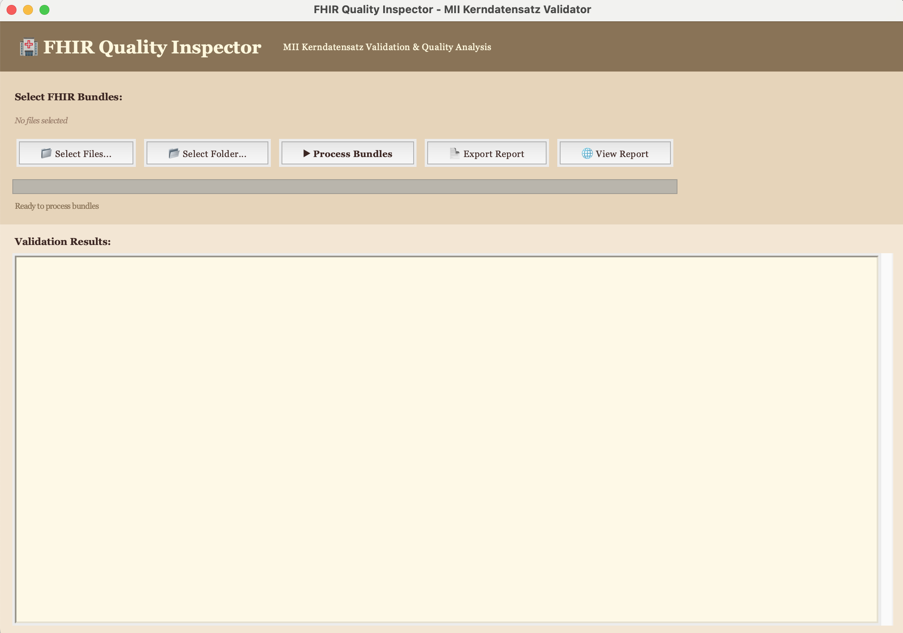

# 🏥 FHIRLint

**Cross-platform desktop application (Python + tkinter) for validating and analyzing FHIR bundles against MII Kerndatensatz standards**

A rapid prototype demonstrating FHIR data validation expertise and healthcare data quality analysis capabilities.

---

## ✨ Features

### Core Functionality
- ✅ **FHIR Bundle Validation** - Parses and validates FHIR Bundle resources
- ✅ **MII Profile Detection** - Automatically detects MII Kerndatensatz modules (Person, Fall, Diagnose, Medikation)
- ✅ **Data Quality Analysis** - 38+ quality checks per bundle including:
  - Required field validation
  - Date format validation
  - ICD-10-GM code format checking
  - Reference integrity verification
  - German postal code validation
- ✅ **Batch Processing** - Process thousands of bundles efficiently
- ✅ **Visual Dashboard** - User-friendly GUI with warm sepia theme and real-time progress
- ✅ **Report Generation** - Export HTML and JSON reports with auto-open in browser

### Quality Checks Implemented
| Check Category | Examples |
|---------------|----------|
| **Required Fields** | Patient identifier, name, gender, birthDate |
| **Data Formats** | Date/datetime validation, postal codes |
| **Terminology** | ICD-10-GM code format, coding system validation |
| **References** | Patient references from Encounter/Condition |
| **MII Profiles** | Profile presence in resource metadata |

---

## 🚀 Quick Start

### Prerequisites

- **Python 3.8+** - [Download here](https://www.python.org/downloads/)
- **Git** - [Download here](https://git-scm.com/downloads)

> **Linux users:** You may need to install `python3-tk` separately:
> ```bash
> sudo apt-get install python3-tk  # Ubuntu/Debian
> sudo dnf install python3-tkinter  # Fedora
> ```

---

### Installation

**1. Clone the repository**

```bash
git clone https://github.com/YOUR-USERNAME/fhirlint.git
cd fhirlint
```

**2. Create virtual environment**

<details>
<summary><b>🐧 Linux / 🍎 macOS</b></summary>

```bash
python3 -m venv venv
source venv/bin/activate
pip install -r requirements.txt
```
</details>

<details>
<summary><b>🪟 Windows</b></summary>

```cmd
python -m venv venv
venv\Scripts\activate
pip install -r requirements.txt
```
</details>

**3. Run the application**

<details>
<summary><b>🐧 Linux / 🍎 macOS</b></summary>

```bash
# Launch GUI
python src/main.py

# Or use the launcher script
./run_app.sh
```
</details>

<details>
<summary><b>🪟 Windows</b></summary>

```cmd
# Launch GUI
python src\main.py

# Or double-click
run_app.bat
```
</details>

---

### Quick Demo

Once the app is running:

1. Click **"📂 Select Folder..."**
2. Choose the `messy_data/` folder (included in repo)
3. Click **"▶ Process Bundles"**
4. See error detection in action!
5. Click **"📄 Export Report"** to generate HTML report
6. Report auto-opens in your browser

---

## 📊 Demo Results

Tested on **1,651 real POLAR FHIR bundles** from MII use case:

```
✓ Valid bundles: 1,651/1,651 (100%)
✓ Average quality score: 100%
✓ 38 quality checks per bundle
✓ All MII modules detected: Person, Fall, Diagnose, Medikation
```

---

## 🏗️ Architecture

```
fhir-quality-inspector/
├── src/
│   ├── main.py                  # GUI application
│   ├── validator.py             # FHIR bundle parser & validator
│   ├── quality_checker.py       # MII quality rules engine
│   ├── report_generator.py      # HTML/JSON report generator
│   └── utils.py                 # Validation utilities
├── data/                        # Test FHIR bundles (1,651 files)
├── output/                      # Generated reports (created on export)
├── requirements.txt             # Python dependencies
└── README.md                    # This file
```

---

## 💡 Use Cases

### For Data Integration Teams (e.g., BIH)
- **Pre-ETL Quality Check** - Validate data before ingestion
- **Post-Transformation Validation** - Verify ETL pipeline output
- **New Data Source Assessment** - Quickly evaluate hospital data quality
- **Compliance Reporting** - Generate quality reports for stakeholders

### For This Demo
- **Clean Data Scenario** - Show 100% pass rate on well-formed MII data
- **Messy Data Scenario** - Demonstrate error detection on problematic data
- **Technical Competency** - Prove understanding of FHIR, MII, and German healthcare context

---

## 📸 Screenshots

### Main Application Window

*Warm sepia-themed interface with file selection, processing controls, and color-coded validation results*

### Processing Results - Clean Data

*100% pass rate on well-formed MII FHIR bundles with quality scores and summary statistics*

### Error Detection - Messy Data

*Detailed error reporting showing missing fields, invalid formats, and broken references*

### HTML Report Dashboard

*Professional HTML report with summary dashboard, quality metrics, and per-bundle analysis*

---

## 🔧 Troubleshooting

### "No module named 'tkinter'"

**Linux:**
```bash
sudo apt-get install python3-tk        # Ubuntu/Debian
sudo dnf install python3-tkinter       # Fedora
sudo pacman -S tk                      # Arch
```

**macOS:**
- tkinter is included with Python from [python.org](https://www.python.org/downloads/)
- If using Homebrew Python: `brew install python-tk`

**Windows:**
- tkinter is included with standard Python installation
- Reinstall Python from [python.org](https://www.python.org/downloads/) if missing

### "fhir.resources not found"

Make sure virtual environment is activated:
```bash
# Linux/macOS
source venv/bin/activate

# Windows
venv\Scripts\activate
```

Then install:
```bash
pip install -r requirements.txt
```

### "Permission denied: ./run_app.sh" (Linux/macOS)

Make script executable:
```bash
chmod +x run_app.sh
./run_app.sh
```

### App won't launch / GUI doesn't appear

1. Check Python version: `python --version` (need 3.8+)
2. Verify tkinter: `python -c "import tkinter; print('OK')"`
3. Try running directly: `python src/main.py`

---

## 🛠️ Technical Stack

| Component | Technology |
|-----------|-----------|
| **Language** | Python 3.11+ |
| **FHIR Library** | fhir.resources 7.1.0 |
| **GUI** | tkinter (built-in) |
| **Validation** | Custom MII quality rules |
| **Reports** | HTML5 + JSON |

---

## 📝 Development Timeline

**Total Time: ~8 hours** (Weekend prototype)

- ✅ **Phase 1** (2h): Bundle parser & validator
- ✅ **Phase 2** (2h): Quality checker with MII rules
- ✅ **Phase 3** (2h): Tkinter GUI
- ✅ **Phase 4** (2h): Report generation & polish

---

## 🎯 Future Enhancements (V2)

- [ ] Full StructureDefinition validation against MII profiles
- [ ] Terminology server integration for CodeSystem/ValueSet validation
- [ ] Additional MII modules (Labor, Prozedur, etc.)
- [ ] Batch report comparison (track quality over time)
- [ ] CLI mode for CI/CD integration
- [ ] Rust + egui version for native performance

---

## 📚 MII Kerndatensatz Context

This tool validates against the **Medizininformatik-Initiative (MII) Kerndatensatz** profiles, which standardize clinical data in German university hospitals.

**Detected Modules:**
- `modul-person` - Patient demographics
- `modul-fall` - Encounter/case data
- `modul-diagnose` - ICD-10-GM diagnoses
- `modul-medikation` - Medication data

Learn more: [https://www.medizininformatik-initiative.de](https://www.medizininformatik-initiative.de)

---

## 👤 Author

Created as a rapid prototype to demonstrate:
- FHIR expertise
- Healthcare data quality analysis
- German healthcare context knowledge (MII, ICD-10-GM)
- Rapid prototyping skills
- Clean, maintainable code

**Built in one weekend** for a job application to demonstrate technical competency.

---

## 📄 License

This is a demonstration project. Not for production use.